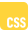

## Hi there 👋
#### i'm Pedro, full-stack web developer with 5 years of diverse experience spanning both web development and enterprise service solutions. I began my career as a Junior Web Developer at Freenet Digital before transitioning into ServiceNow roles at ProV Brasil, DXC Technology, and Proturity GmbH—where I contributed to major projects for clients like Gerdau. Recently, I completed an intensive 3-month Next.js bootcamp to refresh and enhance my full-stack web development skills. I am now eager to leverage my broad technical background and agile problem-solving in a dedicated web development role.

    

### Skills:
1. JS 
2. CSS 
3. HTML 
4. React 
5. Nextjs 
6. Mongo DB

### About:

- 🌱 Learning Nextjs and looking forward to work with it
- 👯 Looking to collaborate on web and software development jobs

### Work experiences

web dev at Freenet digital in 2020
servicenow consultant from 2021 to 2024
Looking forward to continue my career on software/web development
